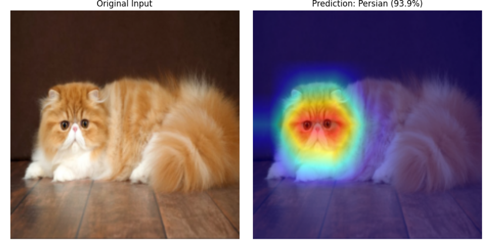

# 🐈 Cat Breed Recognition

Fine-grained image classification of 12 cat breeds using transfer learning, with a systematic comparison of three CNN architectures and an iterative improvement pass on the best-performing model.

**Team:** Stefan Auer, Mohammad Kashefirad, Kilian Lorenz

## Problem

Cat breed identification is a fine-grained visual classification (FGVC) task — the challenge isn't distinguishing cats from dogs, it's distinguishing an Abyssinian from a Bengal based on subtle differences in ear shape, fur texture, and facial structure, while the same breed can look very different depending on pose, lighting, or background.

**Goal:** given an RGB image, predict the correct breed (1 of 12) with a confidence score, plus a Grad-CAM heatmap showing which image regions drove the prediction.

**Why it matters:** breed-specific health predisposition awareness for owners, faster intake labeling for animal shelters, and general curiosity for cat owners who don't know their cat's breed.

## Dataset

- **Source:** Oxford-IIIT Pet Dataset (Parkhi et al., 2012)
- **Classes:** 12 cat breeds
- **Size:** 2,400 images total, 200 per breed
- **Split:** 80/20 train/validation (160 / 40 images per breed), augmentation applied only to training data

## Approach

Three pretrained (ImageNet-1k) CNN architectures were fine-tuned and benchmarked as baselines:

| Model | Type | Params | Rationale |
|---|---|---|---|
| ResNet50 | CNN | ~25.6M | Standard, well-understood transfer-learning reference point |
| EfficientNet-B2 | CNN | ~5.3M | Lightweight alternative via compound scaling |
| ConvNeXt-tiny | CNN (ViT-inspired) | ~28.6M | Modern hybrid design, strong on small datasets |

**Baseline setup:** AdamW optimizer, 5 epochs, batch size 32, learning rate 1e-4, cross-entropy loss, standard augmentation (color jitter, horizontal flip, rotation).

## Results

### Baseline comparison (5 epochs)

| Model | Val Accuracy | Val Loss | F1 (weighted) | Avg sec/epoch |
|---|---|---|---|---|
| EfficientNet-B2 | 90.00% | 0.3041 | 0.8994 | 42.05s |
| ResNet50 | 90.00% | 0.7911 | 0.8993 | 149.84s |
| **ConvNeXt-tiny** | **95.42%** | **0.1507** | **0.9538** | 102.32s |

ConvNeXt-tiny outperformed both baselines by a wide margin, consistent with its architecture: it borrows design choices from Vision Transformers (larger depthwise kernels, inverted bottleneck, LayerNorm, GELU) while retaining CNN efficiency — a strong combination for fine-grained feature discrimination on a relatively small dataset.

Interestingly, EfficientNet-B2 and ResNet50 matched on accuracy but not on loss (0.30 vs 0.79) — ResNet was far less confident in its correct predictions despite scoring the same, which matters for a pipeline that reports a confidence score. EfficientNet-B2 also achieved this with 5x fewer parameters than ResNet50.

### Improved ConvNeXt-tiny (my focus)

Selected ConvNeXt-tiny as the best baseline and iterated with stronger regularization to reduce overfitting and improve generalization on real-world image variability:

**Changes:** weight decay 1e-2 → 5e-2, added dropout (0.4), label smoothing (0.1), random erasing (p=0.2), stronger augmentation (larger rotation/zoom/color jitter range), doubled training to 10 epochs.

| Metric | Baseline (5 ep) | Improved (10 ep) |
|---|---|---|
| Val Accuracy | 95.42% | **96.67%** |
| F1 (weighted) | 0.9538 | **0.9666** |
| Precision | 0.9564 | 0.9685 |
| Recall | 0.9542 | 0.9667 |

The validation loss increased (0.15 → 0.65) despite better accuracy — this is expected and *not* a regression: label smoothing softens target distributions so even confident correct predictions carry non-zero loss, making the two loss values not directly comparable.

The resulting confusion matrix is near-clean across all 12 breeds. **Ragdoll vs. Birman** remains the one persistent confusion pair across every model tested (baseline and improved) — since this holds regardless of architecture, it reflects genuine visual similarity between these breeds rather than a model weakness.

### Explainability

Grad-CAM heatmaps consistently localize to the head/facial region — the correct area for breed identification — confirming the model learns real visual features rather than exploiting background or pose correlations. In misclassified cases, heatmap attention noticeably diffuses toward the body/background, correlating with lower model confidence.

## Key Takeaways

- Architecture choice mattered more than parameter count: ConvNeXt-tiny (28.6M params) beat ResNet50 (25.6M params) by over 5 points of accuracy on the same data and training budget, due to architectural advantages, not scale.
- Regularization (weight decay, dropout, label smoothing, random erasing) was the primary driver of improvement in the second pass — not additional data or a bigger model.
- Loss values aren't always comparable across configurations — label smoothing is a good example of a change that can raise loss while genuinely improving the model.

## Tech Stack

Python, PyTorch, timm (pretrained model weights), scikit-learn (metrics), Grad-CAM, Matplotlib/Seaborn (visualization)